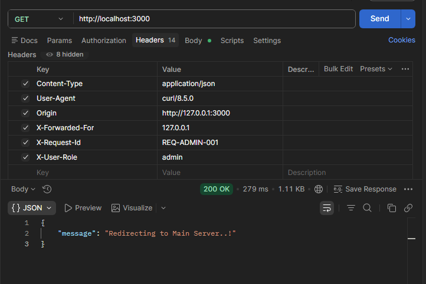

### Incoming Request Data

```json
{ 
  "action": "runSecurityCheck", 
  "method": "GET", 
  "url": "/", 
  "hostname": "127.0.0.1", 
  "socket": { 
    "remoteAddress": "127.0.0.1" 
  }, 
  "ip": "127.0.0.1" 
}
```

### Request Headers

 *(Note: Replace this placeholder link with your actual image path or uploaded URL, such as `headers.png` or an `imgbb` / `imgur` link).*
